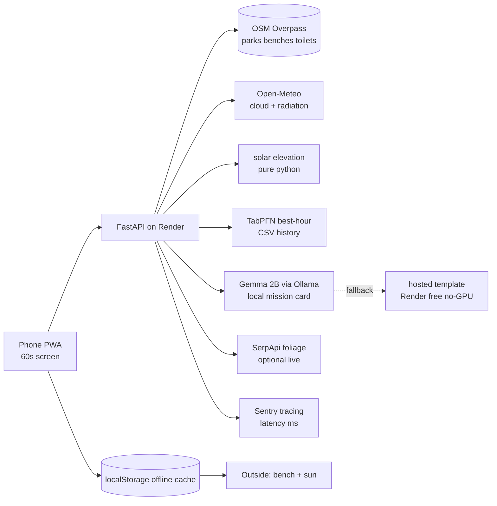

# Architecture

```mermaid
flowchart LR
  U[Phone PWA<br/>60s screen] --> API[FastAPI on Render]
  API --> OSM[(OSM Overpass<br/>parks benches toilets)]
  API --> MET[Open-Meteo<br/>cloud + radiation]
  API --> SUN[solar elevation<br/>pure python]
  API --> TAB[TabPFN best-hour<br/>CSV history]
  API --> GEM[Gemma 2B via Ollama<br/>local mission card]
  GEM -. fallback .-> TPL[hosted template<br/>Render free no-GPU]
  API --> SER[SerpApi foliage<br/>optional live]
  API --> SEN[Sentry tracing<br/>latency ms]
  U --> CACHE[(localStorage offline cache)]
  CACHE --> OUT[Outside: bench + sun]
```
